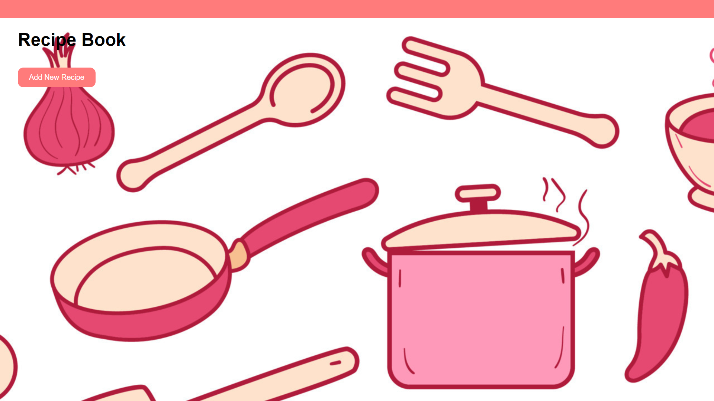
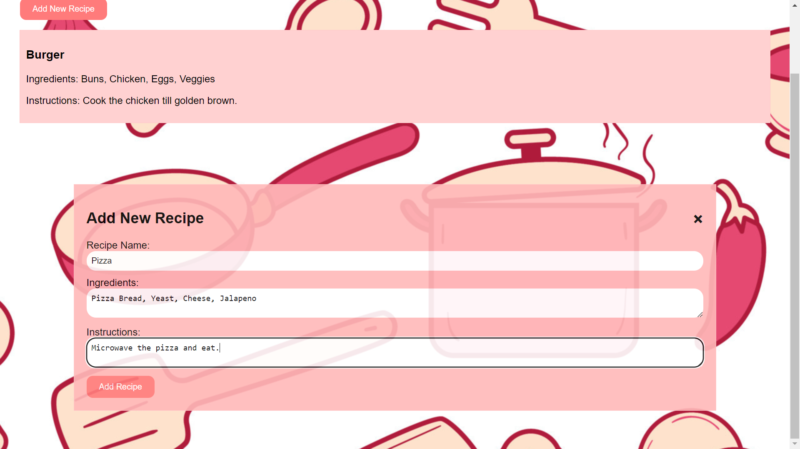
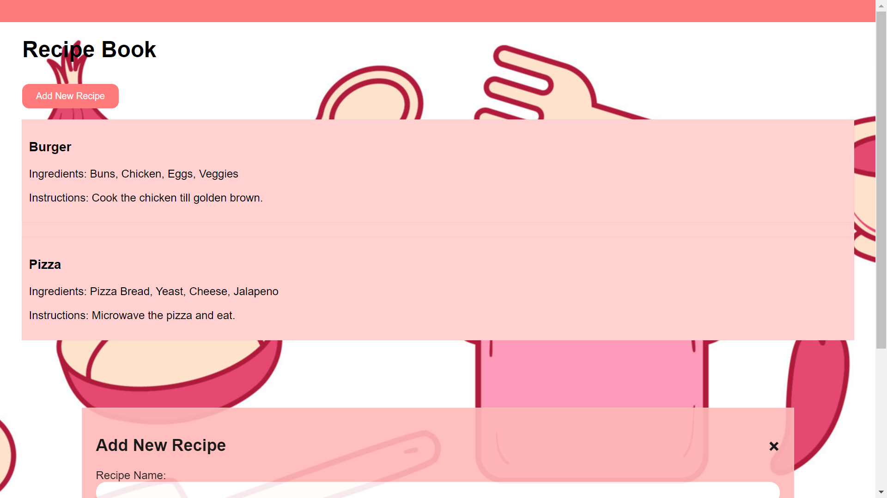

# Recipe_Book
Stores the Ingredients and Instructions of a Recipe.
<html>
  <body>
    <table width="80%">
      <tr>
        <td></td>
        <td></td>
      </tr>
      <tr>
        <td></td>
        <td></td>
      </tr>
    </table>
  </body>
</html>
